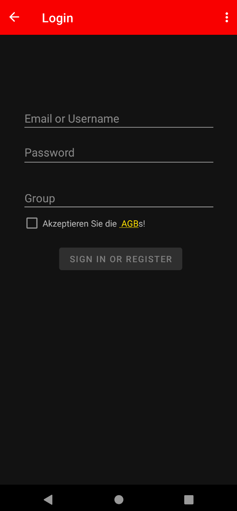

# Essensplaner

## Android App

### Login Screen



### Essensliste


```typescript
public Product(int amount, String name, String description, String brand) {
  this.amount = amount;
  this.name = name;
  this.description = description
  this.brand = brand;
}
```

## Server

Der Server verwendet nodeJS und Express
```javascript
app.use("/", router);
app.use(bodyParser.urlencoded({ extended: false }));
app.use(bodyParser.json());

router.get("/", (req, res) => {
res.sendfile("index.html");
});

app.listen(PORT, () => {
console.log(`Server listening on ${PORT}`);
});
```
### Datenbank


Beispiel die SQLite Datenbank in Javascript zu laden
```javascript
new sqlite3.Database("db/SQLite.db", (err) => {
    if (err) {
        console.error(err.message);
    } else {
        console.log("Connected to the database.");
    }
});
```

Daten aus der Datenbank rufen wir einfach mit SQL befehlen ab
```javascript
db.each(
    "Select * from shopping_list Where user_group = ? and product_name = ?",
    [req.body["group_id"], req.body["product_name"]],
    (err, row) => {
        if (err) console.log(err);
        res.json({ name: row.product_name, amount: row.product_amount });
    }
```
## Unsere Probleme

*   Post und Get request aus Android
*   Android Studio
*   Frontend und Java-Backend Verknüpfung
*   Schul-proxy

## Technologien

*   Android Studio
*   SQLite
*   Server
*   nodeJS
*   Express