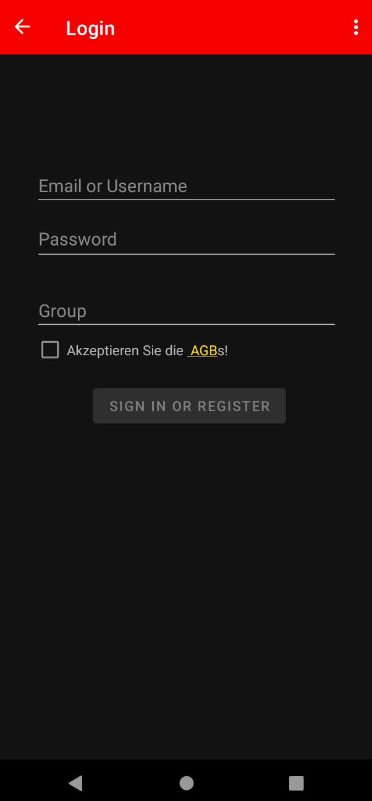
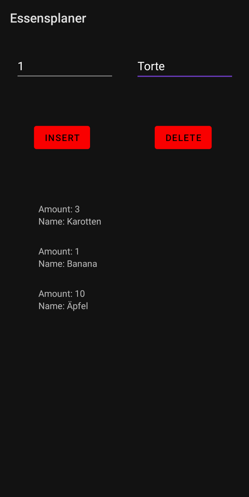

# Essensplaner

## Android App
### Login Screen

### Essensliste

<pre>
<code>
public Product(int amount, String name, String description, String brand) {
  this.amount = amount;
  this.name = name;
  this.description = description;
  this.brand = brand;
}
</code></pre>

## Server
### Database

# Unsere Probleme
- Post und Get 
- Android Studio
- Frontend und Java-Backend Verknüpfung
- Schul-proxy

# Technologien
- Android Studio
- SQLite
- Server
  - nodeJS
  - Express